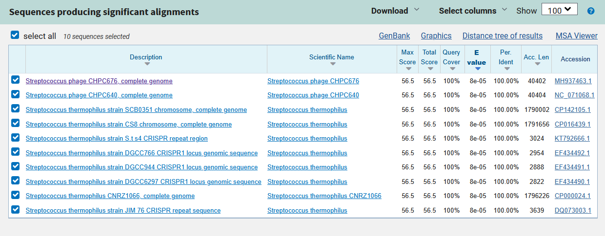
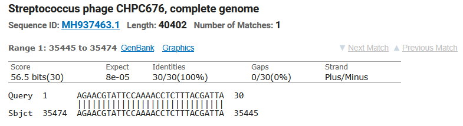

# TP3 - Bacterial Defense Systems

# Étape 1 : télécharger le génome

**Que sont les bases de données « Assembly » et « RefSeq » ? Expliquez rapidement avec vos propres mots.**


La base de données "NCBI Assembly database" nous permet d'accéder et d'avoir un historique des données de l'assemblage génomique.

La base de données "Reference Sequence" ou "RefSeq" contient une collection non redondante de sequences annotées comme, par exemple, l'ADN génomique, des transcriptions ou des protéines. On a utilisé cette base de données dans le dernier labo pour trouveer des homologues.

**Si vous devez télécharger plusieurs centaines de génomes, il vous faudra automatiser (script) le processus. Recherchez rapidement ce que le NCBI propose comme solution et écrivez une courte description.**

Les conseils du NCBI se trouvent sur [cette page](https://www.ncbi.nlm.nih.gov/guide/howto/dwn-records/). Si on veut le faire avec un script, il faut utiliser les fonctions `esearch`, `epost` et `efetch` qu'on trouve dans le livre/site web de "Entrez Programming Utilities".

Solution non-officielle : On peut aussi utiliser des outils comme [NCBI Mass Sequence Downloader](https://github.com/StuntsPT/NCBI_Mass_Downloader) et [NSDPY](https://nsdpy.readthedocs.io/en/latest/main.html).

**L’assemblage d’un génome peut être composé de plusieurs séquences. Combien de séquences notre fichier contient-il ? Donner le(s) identifiant(s). (note : notepad++ suffit)**

Il suffit de compter le nombre de fois que le caractère ">" apparaît dans le fichier. Le fichier contient une séquence. Son identifiant est NC_006449.1 

# Étape 2 : Analyser le génome (CRISPR)

## Questions CRISPR

**Que signifie l’acronyme CRISPR-Cas ?**

CRISPR associated protein

**Quels sont les éléments principaux qui composent le système CRISPR?**


- Répétitions palindromiques : Séquences répétées et espacées dans l'ADN bactérien.  
- Spacers : Fragments d'ADN viral ou plasmidique intercalés entre les répétitions.  
- Gènes cas : Codent pour des protéines comme Cas9, qui coupent l'ADN cible.  
- crRNA : ARN guide qui reconnaît la séquence cible.  
- tracrRNA : Aide à la maturation du crRNA et à l'activation de Cas9.

**Décrivez de manière concise le fonctionnement de CRISPR Cas en général.**

CRISPR-Cas est un système de défense bactérien qui mémorise l’ADN viral et utilise la protéine Cas pour le reconnaître et le couper lors d’une nouvelle infection.

Une fois, un grand bio-informaticien a dit : "C'est un ciseau moléculaire permettant de couper l'ADN à un endroit précis."

## Questions CRISPRCasFinder

**Quelles sont ces options**

On peut chercher des séquences dans CRISPRCasdb, ou fournir notre propre séquences avec un fichier FASTA ou en texte pur. Il y a aussi des options plus avancées pour les experts du CRISPR.

**Dans le cas où vous auriez plus de demandes que ce que ne l’autorise la version web, quelles seraient vos options pour analyser vos génomes avec CRISPRCasFinder ?**

On peut soit faire une demande aux administrateurs pour avoir un accès privilégié, ou on peut installer la version locale.

## Questions CRISPRCasdb

**Quels éléments obtenez-vous ?**

J'ai deux fois la même bactérie, Streptococcus thermophilus CNRZ1066 (firmicutes).

**Que contiennent ces éléments ?**

Une séquence avec deux Cas cluster et un CRISPR.

**Cliquez sur « CP000024_1 » de l’élément « CRISPR ». Quelles informations trouvez-vous dans l’onglet « Détails » (omettez les éléments à 0 ou NA) ? Et dans l’onglet « Fasta » ?**

On a le début et la fin de la séquence, le DR Consensus, sa longueur, le nombre de spacers, et quelques autres informations. Dans l'onglet "Fasta", on a la séquence CP000024_1 ainsi que les séquences des spacers.

# Étape 3 : BLAST

**Que signifie le nt et nr de la base de données dans laquelle nous avons cherché ?**

nt est use base de données de séquences de nucléotides et nr est pour les séquences de protéines

**Combien de séquences produisent un alignement significatif *pour le premier spacer* ? Décrivez les informations que vous obtenez sur la page de résultats ainsi que sur les séquences correspondantes (quelques phrases, résumé des métriques). Ajoutez une capture d’écran des résultats (pour le premier phage).**

Il y a 10 séquences produisant un alignement significatif pour le premier spacer. 



Les métriques sont les suivantes :  score maximal, score total, couverture de la requête, pourcentage de similarité/identité, longueur d'accession et accession.

On a deux phages de *Streptococcus* et différentes parties du *Streptococcus thermophilus* (streptocoque thermophile)



**Pour la première séquence (le premier spacer), à quelles espèces appartiennent les séquences correspondantes trouvées ?**

*Streptococcus* et *Streptococcus thermophilus*, les deux phages sont des descendants du *Brussowvirus*

# Étape 4 : Un peu de parsing !

J'ai utilisé l'outil jq pour le parsing avec la commande suivante:

```bash
jq -r '
  .BlastOutput2[]
  | .report.results.search.hits[]
  | .description[0]?
  | select(.title? != null and (.title | test("phage"; "i")))
  | .title
' Z2BCDXK3016-Alignment.json
```

**A combien de phages nos spacers correspondent-ils ?**

J'ai mis les résultats dans `phages.txt`, le fichier a 66 lignes/résultats -> nos spacers correspondent à 66 phages

**A combien de phages uniques correspondent-ils ?**

Il y a 48 phages uniques

Voici la commande que j'ai utilisé pour trouver cette réponse:

```bash
sort phages.txt | uniq | wc -l
```